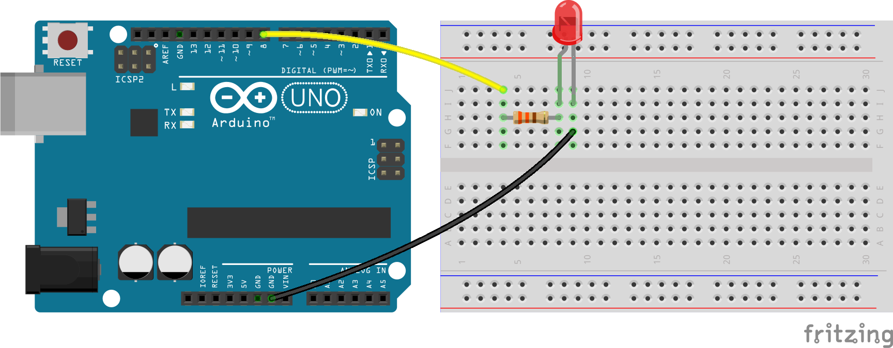

# Hello world

## Diagrama


## Código

Ver componentes
* [Board](http://johnny-five.io/api/board/)
* [Led](http://johnny-five.io/api/led/)

```js
const five = require('johnny-five');
const board = five.Board();

board.on('ready', () => {
    let led = five.Led(8);
    led.blink(1000);
});
```

## Ejecutar

```bash
$ node hello-world.js
```
