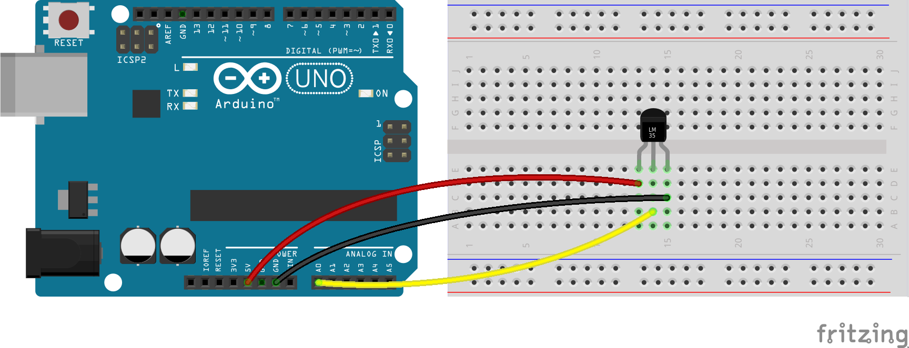

# Sensor de temperatura

## Diagrama




## Código

Ver componente [Thermometer](http://johnny-five.io/api/thermometer/)

```js
var thermometer = new five.Thermometer({
  controller: 'LM35',
  pin: 'A0',
  freq: 1000
});

thermometer.on('data', function () {
  console.log(`Temperatura: ${this.celsius}°C`);
});
```

## Ejecutar

```bash
$ node thermometer.js
```
