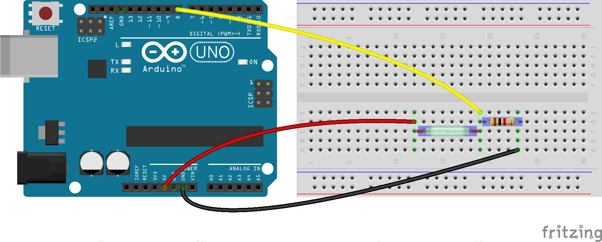

# Switch magnético

## Diagrama


## Código

Ver componente [Switch](http://johnny-five.io/api/switch/)

```js
var reed = five.Switch(8);

reed.on('close', function () {
  console.log('Switch cerrado');
});

reed.on('open', function () {
  console.log('Switch abierto');
});

console.log('Estado inicial: ' + (reed.isClosed ? 'cerrado' : 'abierto'));
```

## Ejecutar

```bash
$ node reed.js
```
