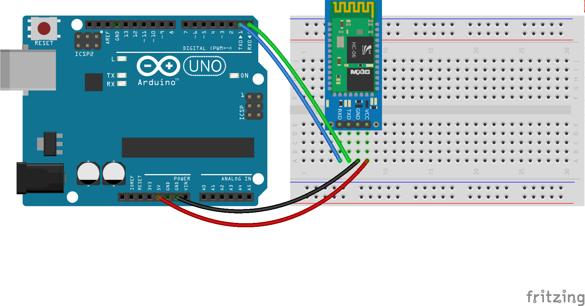
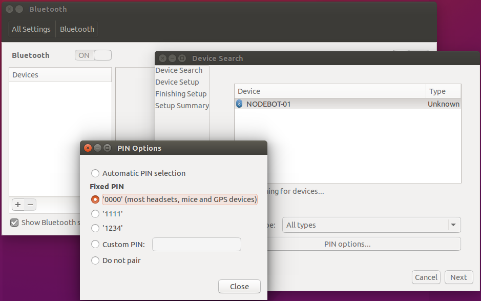

# Conexión bluetooth con el módulo HC-06

En el taller vamos a usar módulos ya preparados para trabajar con johnny-five. Si querés configurar tu propio módulo podés seguir estas instrucciones: [Preparación del módulo HC-06](../../hc-06/preparacion.md)


## Diagrama


## Conexión desde la PC

### Ubuntu
Ir a *System Settings* > *Bluetooth* y configurar el módulo



Luego correr ``hcitool scan`` para obtener la dirección MAC del módulo:
```bash
$ hcitool scan
Scanning ...
	30:14:11:21:00:90	NODEBOT-01
```

Y asociar la dirección MAC al device ``/dev/rfcomm0``
```bash
$ sudo rfcomm bind rfcomm0 30:14:11:21:00:90 1
$ ls -l /dev/rfcomm0
crw-rw---- 1 root dialout 216, 0 ene 17 21:13 /dev/rfcomm0
```

## Código
Ver [Component initialization](http://johnny-five.io/api/board/#component-initialization)

Inicializar el componente ``Board`` pasando como parámetro el puerto que acabamos de crear:
```js
var board = new five.Board({
  port: '/dev/rfcomm0'
});
```

Y dentro del evento ``ready`` de board:
```js
var led = five.Led(13);
led.blink(1000);
```

## Ejecutar

```bash
$ node hc-06.js
```
