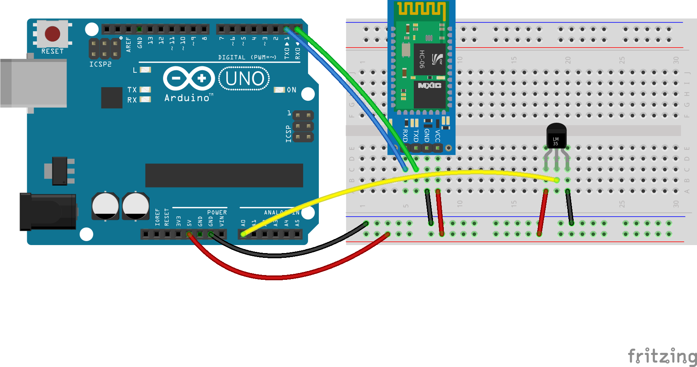

# Hub de dispositivos

Vamos a implementar un hub muy simple que pueda agrupar distintos dispositivos. Para eso vamos a crear una abtracción que nos permita tratarlos de la misma forma.

Un dispositivo tiene que cumplir los siguientes requisitos

1. Ser un [``EventEmitter``](https://nodejs.org/api/events.html) (o heredar de ``EventEmitter``)
1. Tener una propiedad ``name`` (simplemente descriptivo)
1. Tener una propiedad ``events`` indicando los nombres de los eventos que emite (sin contar el evento ``ready``)
1. Tener un método ``init`` para ser llamado durante la inicialización del hub. Una vez que el dispositivo se inicializó correctamente debe emitir el evento ``ready``.

Podemos ver un ejemplo (ya incluído en la lista de dispositivos que maneja el hub) en [mock-device.js](mock-device.js).

Vemos también que el hub no hace mucho más que inicializar los dispositivos y escuchar los eventos que emiten (por ahora sólo los loguea en la consola, en el próximo ejercicio los enviará a una interfaz web).

Si corremos el hub (poemos hacerlo en nuestra computadora en este momento) deberíamos ver lo siguiente:

```bash
$ node hub.js
Device [MockDevice] ready
Hub ready
Device [MockDevice] emitted event [random] { value: 0.8801509307231754 }
Device [MockDevice] emitted event [random] { value: 0.18459032149985433 }
Device [MockDevice] emitted event [random] { value: 0.3199941231869161 }
```

## Sensor de temperatura

Vamos a reimplementar el sensor de temperatura del [ejercicio 2](../02_sensor-temperatura) como un dispositivo que el hub pueda manejar.

### Diagrama



### Código

Implemetar los 4 requisitos que tiene que tener un dispositivo:

1) Ser un EventEmitter
```js
var device = new EventEmitter();
```

2) Tener una propiedad ``name``
```js
device.name = 'Thermometer';
```

3) Tener una propiedad ``events`` con los eventos que emite
```js
device.events = ['temperature'];
```

4) Tener un método ``init`` y emitir el evento ``ready`` una vez que esté inicializado
```js
device.init = function () {
  ...
  device.emit('ready');
  ...
}
```

5) Emitir un evento ``temperature`` con la medición de la temperatura (si bien este no es un requisito, el dispositivo no tendría mucho sentido sin esto)
```js
thermometer.on('data', function () {
  var data = { temperature: this.celsius };
  device.emit('temperature', data);
});
```

Luego agregamos este dispositivo al hub
```js
var thermometer = require('./thermometer.js');

var devices = [mockDevice, thermometer];
```

### Ejecutar

Si ahora corremos el hub (ahora sí tiene que ser en el Raspberry Pi), deberíamos ver los siguiente

```bash
$ node hub.js
Device [MockDevice] connected
1453733197916 Connected /dev/rfcomm0  
Hub ready
Device [MockDevice] emitted event [random] { value: 0.747076835250482 }
Device [Thermometer] connected
Device [Thermometer] emitted event [temperature] { temperature: 27.34375 }
Device [MockDevice] emitted event [random] { value: 0.25436389120295644 }
Device [Thermometer] emitted event [temperature] { temperature: 27.34375 }
Device [Thermometer] emitted event [temperature] { temperature: 27.34375 }
```

**Nota:** para copiar de forma rápida el contenido del taller al Raspberry Pi podemos hacer ``scp -r ./ pi@192.168.1.xxx:/home/pi/workshop-domotica`` (estando ubicados en el raiz del repositorio)
