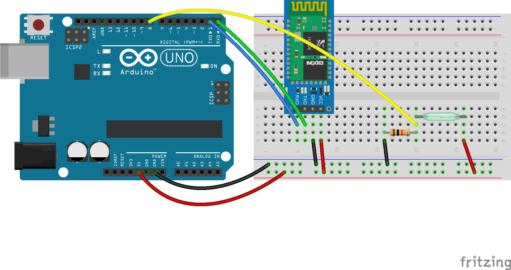

# Agregar lógica a la web

Vamos utilizar el switch magnético para hacer que nuestro sistema nos envíe un email recordándonos llevar paraguas cuando salimos de casa y está lloviendo.

## Diagrama



## Código

El código de este ejercicio está basado en los ejecicios anteriores.

[hub/door.js](hub/door.js) es una implementación del switch magnético como dispositivo reconocible por nuestro hub, tal cual como hicimos con el sensor de temperatura en ejercicio anterior.

En el hub lo único que tenemos que cambiar es la ip por la de nuestra laptop
```js
var io = ioClient('http://your-ip:3000/hub'); // <-- reemplazar por tu ip
```

Y en la aplicación web, implementar la lógica de ``onDoorOpen``
```js
getWeather((error, weather) => {
  if (weather.main === 'Rain') {
    sendMail({
      subject: 'Hoy llueve!',
      text: 'No te olvides el paraguas ;)'
    });
  }
});
```

Para que puedan enviarse los emails correctamente, también es necesario configurar los datos de la cuenta de email en [web/email.js](web/email.js).
