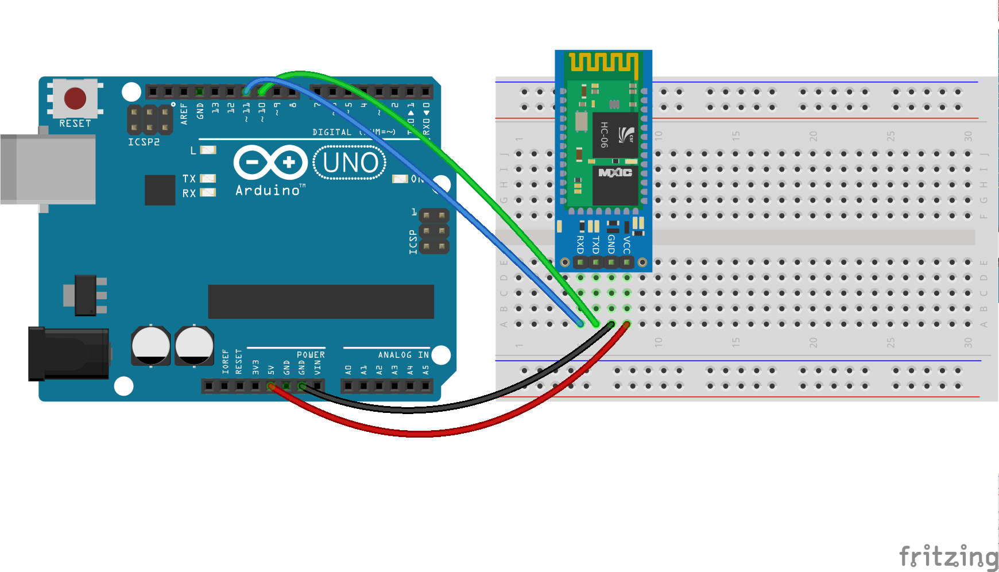

# Preparación del módulo HC-06

Firmata y Johnny-five esperan que la conexión serie funcione a 57600 baudios. El módulo HC-06 funciona a 9600 baudios por defecto, así que tenemos que configurarlo. Y de paso le cambiamos el nombre para que sea más fácil reconocerlo.

## Conexión para la configuración

Conectar los pines TX y RX del módulo HC-06 a los pines 10 y 11, para poder comunicarnos con el módulo a través de una interfaz ``SoftwareSerial`` y enviarle comandos AT para configurarlo. Usamos una interfaz ``SoftwareSerial`` porque queremos dejar libre la interfaz serie nativa (``Serial``) para ver el resultado a través de *Serial Monitor*.



Subimos el código para configurar el módulo con **Arduino IDE**:
```c
#define ROBOT_NAME "NODEBOT-01"

// If you haven't configured your device before use this
#define BLUETOOTH_SPEED 9600
// If you are modifying your existing configuration, use this:
// #define BLUETOOTH_SPEED 57600

#include <SoftwareSerial.h>

// Swap RX/TX connections on bluetooth chip
//   Pin 10 --> Bluetooth TX
//   Pin 11 --> Bluetooth RX
SoftwareSerial mySerial(10, 11); // RX, TX


/*
  The posible baudrates are:
    AT+BAUD1-------1200
    AT+BAUD2-------2400
    AT+BAUD3-------4800
    AT+BAUD4-------9600 - Default for hc-06
    AT+BAUD5------19200
    AT+BAUD6------38400
    AT+BAUD7------57600 - Johnny-five speed
    AT+BAUD8-----115200
    AT+BAUD9-----230400
    AT+BAUDA-----460800
    AT+BAUDB-----921600
    AT+BAUDC----1382400
*/


void setup()
{
  Serial.begin(9600);
  while (!Serial) {
    ; // wait for serial port to connect. Needed for Leonardo only
  }
  Serial.println("Starting config");
  mySerial.begin(BLUETOOTH_SPEED);
  delay(1000);

  // Should respond with OK
  mySerial.print("AT");
  waitForResponse();

  // Should respond with its version
  mySerial.print("AT+VERSION");
  waitForResponse();

  // Set pin to 0000
  mySerial.print("AT+PIN0000");
  waitForResponse();

  // Set the name to ROBOT_NAME
  mySerial.print("AT+NAME");
  mySerial.print(ROBOT_NAME);
  waitForResponse();

  // Set baudrate to 57600
  mySerial.print("AT+BAUD7");
  waitForResponse();

  Serial.println("Done!");
}

void waitForResponse() {
    delay(1000);
    while (mySerial.available()) {
      Serial.write(mySerial.read());
    }
    Serial.write("\n");
}

void loop() {}
```

Para verificar que se haya ejecutado sin problemas abrimos el **Serial Monitor** (Tools -> Serial Monitor):
```
Starting config
OK
OKlinvorV1.8
OKsetPIN
OKsetname
OK57600
Done!
```

## Conexión para usar con Johnny-five
Volver a [cargar Firmata](../firmata.md) en el Arduino y conectar el módulo HC-06 a la interfaz serie nativa de la placa (pines RX y TX, o 0 y 1).


## ¿Problemas?
Para una versión más completa de esta guía, ver [Getting Started with Johnny Five and JY MCU Bluetooth Serial Port Module](https://github.com/rwaldron/johnny-five/wiki/Getting-Started-with-Johnny-Five-and-JY-MCU-Bluetooth-Serial-Port-Module) (el módulo JY-MCU es un breakout board para el HC-06, de iguales características al que usamos en el taller).
